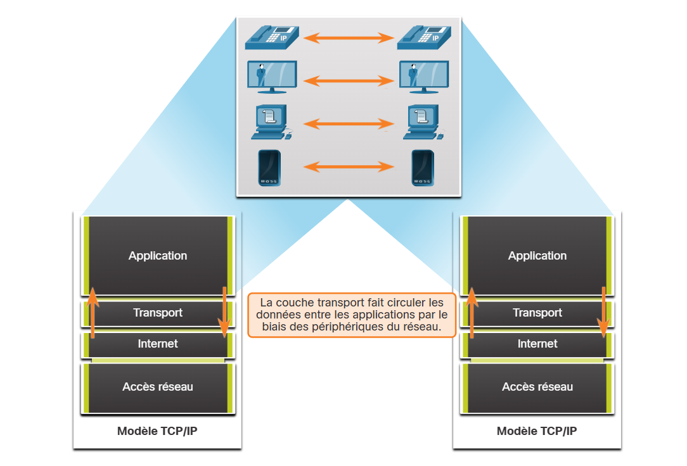

### 14.1.1 Rôle de la couche transport

Les programmes de la couche application génèrent des données qui doivent être échangées entre les hôtes source et destination. La couche de transport est responsable des communications logiques entre les applications exécutées sur différents hôtes. Cela peut inclure des services tels que l'établissement d'une session temporaire entre deux hôtes et la transmission fiable d'informations pour une application.

Comme le montre l'illustration, la couche transport constitue la liaison entre la couche application et les couches inférieures chargées de la transmission sur le réseau.

La couche transport ne connaît pas le type d'hôte de destination, le type de support sur lequel les données doivent voyager, le chemin emprunté par les données, l'encombrement d'une liaison ou la taille du réseau.

La couche de transport comprend deux protocoles:

* Protocole TCP (Transmission Control Protocol)
* Protocole UDP (User Datagram Protocol)

### 14.1.2 Responsabilités de la couche transport

**Suivi des conversations individuelles**

Au niveau de la couche transport, chaque ensemble de données circulant entre une application source et une application destination est connu sous le nom de conversation et est suivi séparément. La couche transport est chargée de garantir ces multiples conversations et d'en effectuer le suivi.

Comme l'illustre la figure, un hôte peut avoir plusieurs applications qui communiquent simultanément sur le réseau.

La plupart des réseaux limitent la quantité de données pouvant être incluses dans un paquet. Par conséquent, les données doivent être divisées en morceaux gérables.

**Segmentation des données et reconstitution des segments**

C'est la responsabilité de la couche de transport de diviser les données de l'application en blocs de taille appropriée. Selon le protocole de couche de transport utilisé, les blocs de couche de transport sont appelés segments ou datagrammes. La figure illustre la couche de transport en utilisant différents blocs pour chaque conversation.

La couche de transport divise les données en blocs plus petits (c'est-à-dire des segments ou des datagrammes) qui sont plus faciles à gérer et à transporter.

**Ajouter des informations d'en-tête**

Le protocole de la couche transport ajoute également à chaque bloc de données des informations d'en-tête contenant des données binaires organisées en plusieurs champs. Ce sont les valeurs contenues dans ces champs qui permettent aux différents protocoles de couche transport d'exécuter des fonctions diverses de gestion des communications de données.

Par exemple, les informations d'en-tête sont utilisées par l'hôte récepteur pour réassembler les blocs de données dans un flux de données complet pour le programme de couche d'application de réception.

La couche transport s'assure que même lorsque plusieurs applications s'exécutent sur un périphérique, toutes les applications reçoivent les données correctes.

**Identification des applications**

La couche transport doit pouvoir segmenter et gérer plusieurs communications ayant des exigences différentes en matière de transport. Pour transmettre les flux de données aux applications appropriées, la couche transport identifie l'application cible à l'aide d'un identifiant appelé numéro de port. Comme l'illustre la figure, chaque processus logiciel qui doit accéder au réseau se voit attribuer un numéro de port unique à cet hôte.

**Multiplexage de conversations**

L'envoi de certains types de données (par exemple, une vidéo en continu) sur un réseau, en tant que flux de communication complet, peut consommer toute la largeur de bande disponible. De fait, cela empêche d'autres communications d'avoir lieu en même temps. En outre, cela rend également difficiles la reprise sur erreur et la retransmission des données endommagées.

Comme le montre la figure, la couche de transport utilise la segmentation et le multiplexage pour permettre à différentes conversations de communication d'être entrelacées sur le même réseau.

La vérification des erreurs peut être effectuée sur les données du segment, afin de déterminer si le segment a été altéré pendant la transmission.

14.1.3 Protocoles de couche transport

IP ne s'occupe que de la structure, de l'adressage et du routage des paquets. Il ne fixe pas le mode d'acheminement ou de transport des paquets.

Les protocoles de La couche de transport spécifient comment transférer des messages entre les hôtes et ils sont responsables de la gestion des exigences de fiabilité d'une conversation. La couche transport comprend les protocoles TCP et UDP.

Des applications différentes ont des exigences différentes en matière de fiabilité du transport. Par conséquent, TCP/IP fournit deux protocoles de couche de transport, comme indiqué sur la figure.

14.1.4 Protocole TCP (Transmission Control Protocol)

L'IP ne concerne que de la structure, l'adressage et le routage des paquets, de l'expéditeur initial à la destination finale. IP n'est pas responsable de garantir la livraison ou de déterminer si une connexion entre l'expéditeur et le destinataire doit être établie.

Le protocole TCP est un protocole de couche transport fiable et complet, qui garantit que toutes les données arrivent à la destination. TCP inclut des champs qui assurent la livraison des données de l'application. Ces champs nécessitent un traitement supplémentaire par les hôtes d'envoi et de réception.

**Remarque**: Le protocole TCP divise les données en segments.

Le transport TCP revient à envoyer des paquets qui sont suivis de la source à la destination. Si la commande à expédier est divisée en plusieurs colis, un client peut vérifier en ligne l'ordre des livraisons.

TCP assure la fiabilité et le contrôle du flux en utilisant les opérations de base suivantes:

* Numéroter et suivre les segments de données transmis à un hôte spécifique à partir d'une application spécifique
* Accuser la réception des données reçues
* Retransmettre toute donnée non reconnue après un certain temps
* Données de séquence qui pourraient arriver dans le mauvais ordre
* Envoyer des données à un taux efficace et acceptable par le destinataire

Afin de maintenir l'état d'une conversation et de suivre les informations, TCP doit d'abord établir une connexion entre l'expéditeur et le destinataire. Le protocole TCP est un protocole connexion orienté.

Cliquez sur Lecture dans l'illustration pour voir comment des accusés de réception et des segments TCP sont transmis entre un expéditeur et son destinataire.

14.1.5 Protocole UDP (User Datagram Protocol)

UDP est un protocole de couche de transport plus simple que TCP. Il ne fournit pas de fiabilité et de contrôle de flux, ce qui signifie qu'il nécessite moins de champs d'en-tête. Étant donné que les processus UDP de l'expéditeur et du récepteur n'ont pas à gérer la fiabilité et le contrôle de flux, cela signifie que les datagrammes UDP peuvent être traités plus rapidement que les segments TCP. UDP fournit des fonctions de base permettant d'acheminer des segments de données entre les applications appropriées tout en ne nécessitant que très peu de surcharge et de vérification des données.

**Remarque**: UDP divise les données en datagrammes qui sont également appelés segments.

UDP est un protocole sans connexion. Étant donné que UDP ne fournit pas de fiabilité ou de contrôle de débit, il ne nécessite pas de connexion établie. Car UDP ne suit pas les informations envoyées ou reçues entre le client et le serveur, UDP est également connu sous le nom de protocole sans état.

UDP est également connu comme un protocole de livraison du meilleur effort, car il n'y a pas d'accusé de réception des données à la destination. Avec l'UDP, il n'y a pas de processus de la couche transport qui informe l'expéditeur d'une livraison réussie.

L'UDP est comme le dépôt d'une lettre ordinaire, non recommandée, dans le courrier. L'expéditeur de la lettre ne sait pas si le destinataire pourra la recevoir. En outre, le bureau de poste n'est pas responsable du suivi de la lettre et ne doit pas non plus informer l'expéditeur si elle n'atteint pas sa destination finale.

Cliquez sur Lecture dans la figure pour voir une animation des datagrammes UDP transmis de l'émetteur au récepteur.

14.1.6 Choix du protocole de couche transport le mieux adapté à une application donnée

Certaines applications peuvent tolérer une certaine perte de données lors de la transmission sur le réseau, mais les retards de transmission sont inacceptables. Pour ces applications, l'UDP est le meilleur choix car il nécessite moins de surcharge du réseau. L'UDP est préférable pour les applications telles que la voix sur IP (VoIP). Les accusés de réception et la retransmission ralentiraient la livraison et rendraient la conversation vocale inacceptable.

UDP est également utilisé par les applications de demande et de réponse où les données sont minimales, et la retransmission peut être effectuée rapidement. Par exemple, le service de noms de domaine (DNS) utilise UDP pour ce type de transaction. Le client demande des adresses IPv4 et IPv6 pour un nom de domaine connu à partir d'un serveur DNS. Si le client ne reçoit pas de réponse dans un délai prédéterminé, il envoie simplement la demande à nouveau.

Par exemple, si au cours d'une lecture vidéo, un ou deux segments n'arrivent pas, cela entraîne une interruption momentanée du flux. Cela peut se traduire par une distorsion de l'image ou du son, que l'utilisateur ne remarque peut-être même pas. Si par contre le périphérique de destination doit tenir compte de la perte de données, il se peut que le flux soit retardé à cause des retransmissions qu'il attend, causant ainsi une forte dégradation de la qualité de l'image ou du son. Dans ce cas, il est préférable de fournir la meilleure qualité possible en fonction des segments reçus et de renoncer à la fiabilité.

Pour d'autres applications, il est important que toutes les données arrivent et qu'elles puissent être traitées dans leur ordre approprié. Pour ces types d'applications, TCP est utilisé comme protocole de transport. Par exemple, les applications telles que les bases de données, les navigateurs web et les clients de messagerie ont besoin que toutes les données envoyées arrivent à destination dans leur état d'origine. Toute donnée manquante pourrait corrompre une communication, la rendre soit incomplète soit illisible. Par exemple, lorsqu'on accède aux informations bancaires sur le Web, il est important de s'assurer que toutes les informations sont envoyées et reçues correctement.

Les développeurs d'applications doivent déterminer quel type de protocole de transport est approprié en fonction des exigences des applications. La vidéo peut être envoyée via TCP ou UDP. Les applications qui diffusent en continu des données audio et vidéo stockées utilisent généralement le protocole TCP. L'application utilise TCP pour effectuer la mise en mémoire tampon, la détection de la bande passante et le contrôle de la congestion, afin de mieux contrôler l'expérience utilisateur.

La vidéo et la voix en temps réel utilisent généralement UDP, mais peuvent également utiliser TCP, ou les deux UDP et TCP. Une application de vidéo conférence peut utiliser UDP par défaut, mais comme de nombreux pare-feu bloquent UDP, l'application peut également être envoyée par TCP.

Les applications qui diffusent en continu des données audio et vidéo stockées utilisent le protocole TCP. Par exemple, si votre réseau ne peut soudainement plus prendre en charge la bande passante nécessaire pour regarder un film à la demande, l'application interrompt la lecture. Pendant cette interruption, un message de mise en tampon peut apparaître tandis que le protocole TCP s'efforce de rétablir le flux de données. Lorsque tous les segments sont en ordre et qu'un niveau minimum de bande passante est rétabli, votre session TCP reprend, et la lecture du film reprend.

La figure résume les différences entre l'UDP et le TCP.

