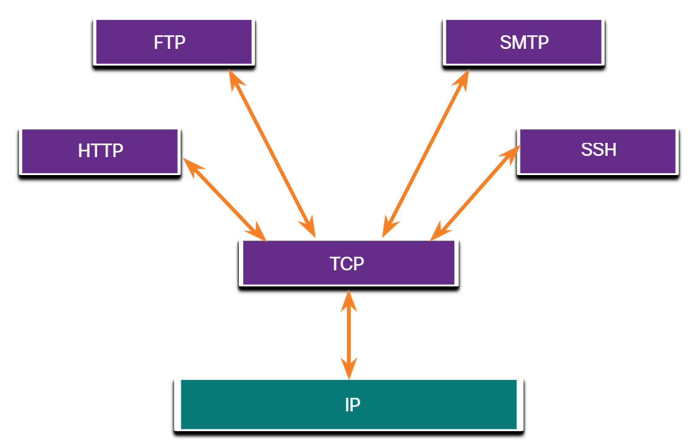

# 14.2 Présentation du protocole TCP

14.2.1 Fonctions du protocole TCP

Dans la rubrique précédente, vous avez appris que TCP et UDP sont les deux protocoles de couche de transport. Cette rubrique donne plus de détails sur ce que fait TCP et quand il est conseillé de l'utiliser au lieu d'UDP.

Pour comprendre les différences entre TCP et UDP, il est important de comprendre comment chaque protocole met en œuvre des caractéristiques de fiabilité spécifiques et comment chaque protocole suit les conversations.

En plus de soutenir les fonctions de base de la segmentation et du réassemblage des données, le TCP fournit également les services suivants :

* **Établit une session** - TCP est un protocole connexion orienté qui négocie et établit une connexion (ou session) permanente entre les appareils source et destination avant d'acheminer tout trafic. Grâce à l'établissement de la session, les périphériques négocient la quantité de trafic pouvant être transmise à un moment donné et les données de communication peuvent être étroitement gérées.
* **Garantit une livraison fiable** - Pour de nombreuses raisons, il est possible qu'un segment soit corrompu ou complètement perdu lors de sa transmission sur le réseau. TCP s'assure que chaque segment envoyé par la source arrive à la destination.
* **Fournit la livraison dans le même ordre** - Parce que les réseaux peuvent fournir plusieurs routes qui peuvent avoir des taux de transmission différents, les données peuvent arriver dans le mauvais ordre. En numérotant et en séquençant les segments, TCP s'assure que les segments sont réassemblés dans le bon ordre.
* **Soutien le contrôle des flux** - Les hôtes du réseau ont des ressources limitées (c'est-à-dire, mémoire et puissance de traitement). Quand le protocole TCP détermine que ces ressources sont surexploitées, il peut demander à l'application qui envoie les données d'en réduire le flux. Cela se fait par le TCP qui régule la quantité de données transmises par la source. Le contrôle du flux contribue à rendre inutile la retransmission des données lorsque les ressources de l'hôte de réception sont saturées.

Pour plus d'informations sur TCP, recherchez la RFC 793 sur Internet.

14.2.2 En-tête TCP

TCP est un protocole avec état, ce qui signifie qu'il garde une trace de l'état de la session de communication. Pour suivre l'état d'une session, le protocole TCP enregistre les informations qu'il a envoyées et les informations qu'il a reçues. La session en état commence avec l'établissement de la session et se termine avec la clôture de la session.

Un segment TCP ajoute 20 octets (c'est-à-dire 160 bits) de surcharge lors de l'encapsulation des données de la couche d'application. La figure montre les champs d'un en-tête TCP.

14.2.3 Champs d'en-tête TCP

Le tableau identifie et décrit les dix champs d'un en-tête TCP.

| **Champ d'en-tête**TCP              | **Description**                                                                                                            |
| ------------------------------------ | -------------------------------------------------------------------------------------------------------------------------- |
| **Port source**                      | Champ 16 bits utilisé pour identifier l'application source par le numéro de port.                                        |
| **Port de destination**              | Champ 16 bits utilisé pour identifier l'application de destination par numéro de port.                                   |
| **Numéro d'ordre**                  | Champ 32 bits utilisé à des fins de réassemblage de données.                                                           |
| **Numéro d’accusé de réception** | Champ 32 bits utilisé pour indiquer que les données ont été reçues et que le prochain octet est attendu de la source. |
| **Longueur d’en-tête**             | Un champ 4 bits connu sous le nom de «offset de données» qui indique la longueur de l'en-tête du segment TCP.          |
| **Réservé**                        | Un champ de 6 bits qui est réservé pour une utilisation future.                                                          |
| **Bits de contrôle**                | Champ 6 bits qui inclut des codes de bits, ou des indicateurs, qui indiquent l'objectif et la fonction du segment TCP.     |
| **Taille de fenêtre**               | Champ 16 bits utilisé pour indiquer le nombre d'octets pouvant être acceptés à un moment donné.                       |
| **Somme de contrôle**               | Un champ de 16 bits utilisé pour la vérification des erreurs de l'en-tête du segment et des données.                   |
| **Urgent**                           | Champ 16 bits utilisé pour indiquer si les données contenues sont urgentes.                                              |

14.2.4 Applications utilisant le protocole TCP

TCP est un bon exemple de la manière dont les différentes couches de la suite de protocoles TCP/IP ont des rôles spécifiques. Le TCP gère toutes les tâches associées à la division du flux de données en segments, à la fiabilité, au contrôle du flux de données et à la réorganisation des segments. Le protocole TCP libère l'application de la gestion de l'ensemble de ces tâches. Les applications, telles que celles illustrées dans la figure, peuvent simplement envoyer le flux de données à la couche transport et utiliser les services du protocole TCP.

