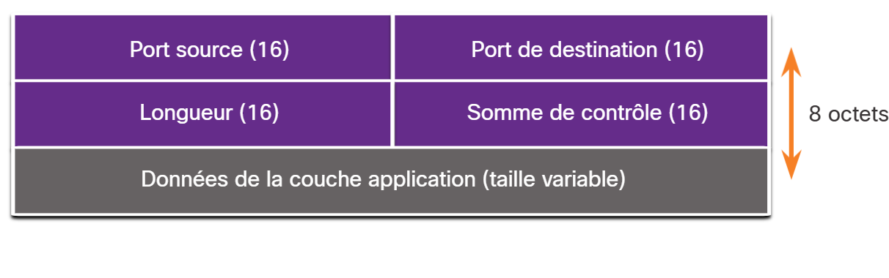
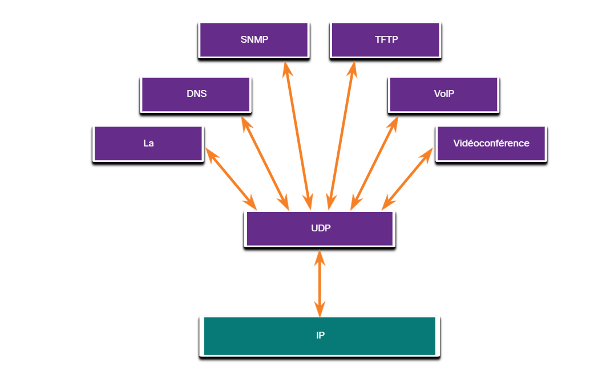

# 14.3 Aperçu de l'UDP

14.3.1 Fonctions du protocole UDP

Cette rubrique couvrira UDP, ce qu'il fait et quand il est conseillé de l'utiliser au lieu de TCP. UDP est un protocole de transport optimal. UDP est un protocole de transport léger qui offre la même segmentation et le même réassemblage de données que TCP, mais sans la fiabilité et le contrôle de flux de TCP.

UDP est un protocole tellement simple qu'il est généralement décrit en termes de ce qu'il ne fait pas par rapport à TCP.

Les caractéristiques de l'UDP sont les suivantes :

* Les données sont reconstituées selon l'ordre de réception.
* Les segments qui sont perdus ne sont pas renvoyés.
* Il n'y a pas d'établissement de session.
* L'expéditeur n'est pas informé de la disponibilité des ressources.

Pour plus d'informations sur l'UDP, recherchez le RFC sur Internet.

14.3.2 En-tête UDP

L'UDP est un protocole sans état, ce qui signifie que ni le client, ni le serveur, ne suit l'état de la session de communication. Si la fiabilité est nécessaire dans le cadre de l'utilisation d'UDP comme protocole de transport, elle doit être prise en charge par l'application.

L'une des conditions les plus importantes pour fournir une vidéo en direct et faire transiter des données vocales sur un réseau est que le flux de données soit rapide. Les applications vidéo en direct et de communication vocale peuvent tolérer certaines pertes de données, dont l'impact est faible ou indétectable, et sont donc parfaitement adaptées au protocole UDP.

Les blocs de communication dans l'UDP sont appelés datagrammes, ou segments. Ces datagrammes sont envoyés au mieux par le protocole de la couche transport.

L'en-tête UDP est beaucoup plus simple que l'en-tête TCP car il n'a que quatre champs et nécessite 8 octets (c'est-à-dire 64 bits). La figure montre les champs d'un en-tête UDP.

14.3.3 Champs d'en-tête UDP

Le tableau identifie et décrit les quatre champs d'un en-tête UDP.

| **Champ d'en-tête UDP** | **Description**                                                                                       |
| ------------------------ | ----------------------------------------------------------------------------------------------------- |
| **Port source**          | Champ 16 bits utilisé pour identifier l'application source par le numéro de port.                   |
| **Port de destination**  | Champ 16 bits utilisé pour identifier l'application de destination par numéro de port.              |
| **Longueur**             | Champ 16 bits indiquant la longueur de l'en-tête de datagramme UDP.                                  |
| **Somme de contrôle**   | Champ 16 bits utilisé pour la vérification des erreurs de l'en-tête et des données du datagramme. |

14.3.4 Applications utilisant l'UDP

Il existe trois types d'application plus adaptés au protocole UDP:

* **Applications vidéo et multimédia en direct** - Ces applications peuvent tolérer une certaine perte de données, mais ne nécessitent que peu ou pas de délai. La voix sur IP et le streaming vidéo en sont de bons exemples.
* **Applications simples de demande et de réponse** - Applications avec des transactions simples où un hôte envoie une demande et peut ou non recevoir une réponse. Exemples comprennent le DNS et le DHCP.
* **Applications qui gèrent elles-mêmes la fiabilité** - Communications unidirectionnelles où le contrôle de flux, la détection des erreurs, les accusés de réception et la récupération des erreurs ne sont pas nécessaires, ou peuvent être gérés par l'application. Exemples incluent: SNMP et TFTP.

La figure identifie les applications qui nécessitent UDP.

Bien que DNS et SNMP utilisent UDP par défaut, ces deux protocoles peuvent également utiliser TCP. Le DNS utilisera TCP si la requête ou la réponse DNS est supérieure à 512 octets, par exemple lorsqu'une réponse DNS comprend de nombreuses résolutions de noms. De manière similaire, dans certaines situations, il se peut que l'administrateur réseau souhaite configurer SNMP de manière à utiliser TCP.
