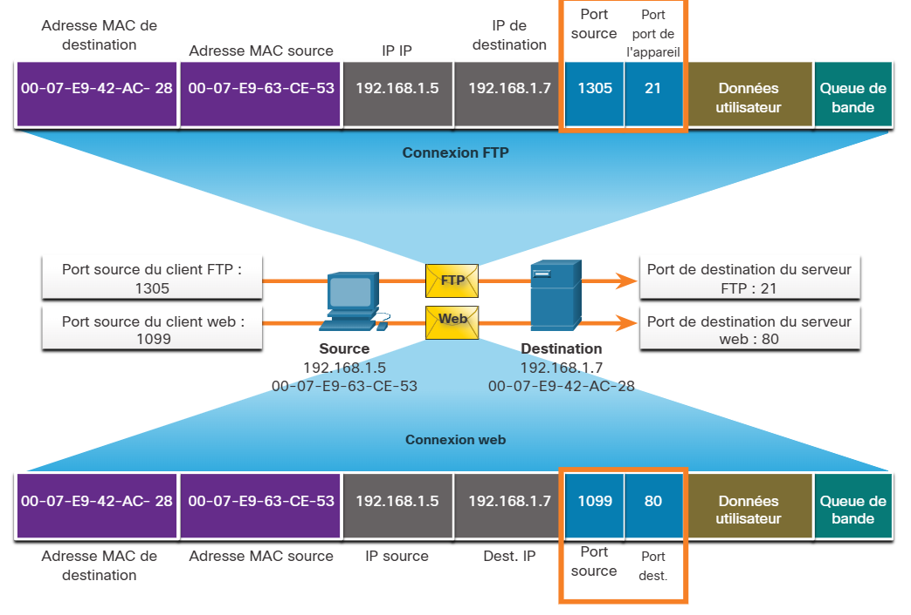

# 14.4 Numéros de port


14.4.1 Communications Multiples et Séparées

Comme vous l'avez appris, il y a certaines situations dans lesquelles TCP est le bon protocole pour le travail, et d'autres situations dans lesquelles UDP devrait être utilisé. Quel que soit le type de données transportées, TCP et UDP utilisent des numéros de port.

Les protocoles de couches de transport TCP et UDP utilisent des numéros de port pour gérer plusieurs conversations simultanées. Comme le montre la figure, les champs d'en-tête TCP et UDP identifient un numéro de port d'application source et destination.


Le numéro de port source est associé à l'application d'origine sur l'hôte local tandis que le numéro de port de destination est associé à l'application de destination sur l'hôte distant.

Par exemple, supposons qu'un hôte initie une demande de page Web à partir d'un serveur Web. Lorsque l'hôte lance la demande de page Web, le numéro de port source est généré dynamiquement par l'hôte pour identifier de manière unique la conversation. Chaque requête générée par un hôte utilisera un numéro de port source différent, créé dynamiquement. Ce processus permet d'avoir plusieurs conversations simultanément.

Dans la demande, le numéro de port de destination est ce qui identifie le type de service demandé du serveur Web de destination. Par exemple, lorsque le client spécifie le port 80 comme port de destination, le serveur qui reçoit le message sait que des services web sont demandés.

Un serveur peut offrir plusieurs services simultanément, tels que des services web sur le port 80, tandis qu'il propose l'établissement d'une connexion FTP (File Transfer Protocol) sur le port 21.


14.4.2 Paires d'interfaces de connexion

Les ports sources et de destination sont placés à l'intérieur du segment. Les segments sont ensuite encapsulés dans un paquet IP. Le paquet IP contient l'adresse IP de la source et de la destination. La combinaison de l'adresse IP source et du numéro de port source, ou de l'adresse IP de destination et du numéro de port de destination, est appelée interface de connexion.

Dans l'exemple de la figure, le PC demande simultanément des services FTP et Web à partir du serveur de destination.




Dans l'exemple, la requête FTP générée par le PC inclut les adresses MAC de couche 2 et les adresses IP de couche 3. La demande identifie également le port source 1305 (c'est-à-dire généré dynamiquement par l'hôte) et le port de destination, identifiant les services FTP sur le port 21. L'hôte a également demandé une page Web au serveur utilisant les mêmes adresses de couche 2 et de couche 3. Cependant, il utilise le port source numéro 1099 (c'est-à-dire généré dynamiquement par l'hôte) et le port de destination identifiant le service Web sur le port 80.

L'interface de connexion sert à identifier le serveur et le service demandés par le client. Une interface de connexion cliente peut se présenter comme suit, 1099 représentant le numéro du port source : 192.168.1.5:1099

L'interface de connexion d'un serveur web peut être 192.168.1.7:80

Ensemble, ces deux interfaces de connexion constituent une paire d'interfaces de connexion: 192.168.1.5:1099 et 192.168.1.7:80

Les interfaces de connexion permettent à plusieurs processus exécutés sur un client de se différencier les uns des autres, et aux multiples connexions à un processus serveur de se distinguer les unes des autres.

Le numéro de port source fait office d'adresse de retour pour l'application envoyant la requête. La couche transport effectue le suivi du port et de l'application à l'origine de la requête afin que la réponse, quand elle sera envoyée, soit transmise à l'application appropriée.


14.4.3 Groupes de numéros de port

L'IANA (Internet Assigned Numbers Authority) est l'organisme de normalisation chargé d'attribuer diverses normes d'adressage, notamment les numéros de port de 16 bits. Les 16 bits utilisés pour identifier les numéros de port source et de destination fournissent une gamme de ports comprise entre 0 et 65535.

L'IANA a divisé la gamme de numéros en trois groupes de ports suivants.


| **Groupe de ports**                  | **Gamme de numéros** | **Description**                                                                                                                                                                                                                                                                                                                                                                                                                                             |
| ------------------------------------ | --------------------- | ----------------------------------------------------------------------------------------------------------------------------------------------------------------------------------------------------------------------------------------------------------------------------------------------------------------------------------------------------------------------------------------------------------------------------------------------------------- |
| **Ports connus**                     | **de 0 à 1023**      | * Ces numéros de port sont réservés aux services communs ou populaires et des applications telles que les navigateurs web, les clients de messagerie électronique et les clients d'accès à distance.* La définition de ports bien connus pour les applications de serveur commun permet aux clients d'identifier facilement le service associé requis.                                                                                              |
| **Ports inscrits**                   | **de 1024 à 49151**  | * Ces numéros de port sont attribués par IANA à une entité requérante pour être utilisés avec des processus ou des applications spécifiques.* Ces processus sont principalement des applications individuelles qu'un utilisateur a choisi d'installer, plutôt que des applications communes qui recevraient un numéro de port bien connu.* Par exemple, Cisco a enregistré le port 1812 pour son processus d'authentification du serveur RADIUS. |
| **Privé**et/ou **Ports Dynamiques** | **de 49152 à 65535** | * Ces ports sont également connus sous le nom de *ports éphémères*.* Le système d'exploitation du client attribue généralement des numéros de port dynamiquement lorsque une connexion à un service est initiée. {'' ''}* Le port dynamique est ensuite utilisé pour identifier l'application cliente durant la communication.                                                                                                                   |


**Note:** Certains systèmes d'exploitation clients peuvent utiliser des numéros de port enregistrés au lieu de numéros de port dynamiques pour l'attribution des ports sources.

Le tableau présente quelques numéros de port courants bien connus et leurs applications associées.

### Well-Known Port Numbers


| **Numéro de port** | **Protocole** | **Application**                                               |
| ------------------- | ------------- | ------------------------------------------------------------- |
| **20**              | TCP           | FTP (File Transfer Protocol) - Données                       |
| **21**              | TCP           | FTP (File Transfer Protocol) - Contrôle                      |
| **22**              | TCP           | SSH (Secure Shell)                                            |
| **23**              | TCP           | Telnet                                                        |
| **25**              | TCP           | Protocole SMTP                                                |
| **53**              | UDP, TCP      | Service de noms de domaine (Domain Name System, DNS)          |
| **67**              | UDP           | Serveur DHCP (Dynamic Host Configuration Protocol)            |
| **68**              | UDP           | Protocole DHCP (Dynamic Host Configuration Protocol) (client) |
| **69**              | UDP           | Protocole TFTP (Trivial File Transfer Protocol)               |
| **80**              | TCP           | Protocole HTTP (Hypertext Transfer Protocol)                  |
| **110**             | TCP           | protocole POP3 (Post Office Protocol version 3)               |
| **143**             | TCP           | IMAP (Internet Message Access Protocol)                       |
| **161**             | UDP           | Simple Network Management Protocol (SNMP)                     |
| **443**             | TCP           | protocole HTTPS (Hypertext Transfer Protocol Secure)          |

Certaines applications utilisent le protocole TCP et le protocole UDP. Par exemple, DNS utilise le protocole UDP lorsque des clients envoient des requêtes à un serveur DNS. Toutefois, la communication entre deux serveurs DNS se fait toujours via le protocole TCP.

Recherchez le registre des ports sur le site web de l'IANA pour afficher la liste complète des numéros de port et des applications associées.


14.4.4 Commande netstat

Les connexions TCP inexpliquées peuvent poser un risque de sécurité majeur. Elles peuvent signaler que quelque chose ou quelqu'un est connecté à l'hôte local. Il est parfois nécessaire de savoir quelles connexions TCP actives sont ouvertes et s'exécutent sur un hôte en réseau. L'utilitaire netstat est un utilitaire de réseau important qui peut être utilisé pour vérifier ces connexions. Comme indiqué ci-dessous, entrez la commande **netstat** pour lister les protocoles utilisés, l'adresse et les numéros de port locaux, l'adresse et les numéros de port étrangers et l'état de la connexion.

```
C:\> netstat
Active Connections
  Proto  Local Address          Foreign Address            State
  TCP    192.168.1.124:3126     192.168.0.2:netbios-ssn    ESTABLISHED
  TCP    192.168.1.124:3158     207.138.126.152:http       ESTABLISHED
  TCP    192.168.1.124:3159     207.138.126.169:http       ESTABLISHED
  TCP    192.168.1.124:3160     207.138.126.169:http       ESTABLISHED
  TCP    192.168.1.124:3161     sc.msn.com:http            ESTABLISHED
  TCP    192.168.1.124:3166     www.cisco.com:http         ESTABLISHED
(output omitted)
C:\>
```

Par défaut, la **netstat** commande tentera de résoudre les adresses IP en noms de domaine et les numéros de port en applications connues. Cette **-n** option peut être utilisée pour afficher les adresses IP et les numéros de port sous leur forme numérique.
