# 14.5 Processus de communication TCP

14.5.1 Processus serveur TCP

Vous connaissez déjà les principes fondamentaux de TCP. Comprendre le rôle des numéros de port vous aidera à saisir les détails du processus de communication TCP. Dans cette rubrique, vous découvrirez également les processus de poignée de main à trois voies TCP et de fin de session.

Chaque processus de demande s'exécutant sur un serveur est configuré pour utiliser un numéro de port. Le numéro de port est soit attribué automatiquement, soit configuré manuellement par un administrateur système.

Deux services ne peuvent pas être affectés au même numéro de port d'un serveur au sein des mêmes services de la couche transport. Par exemple, un hôte qui exécute une application de serveur web et une application de transfert de fichiers ne peut pas avoir les deux configurées pour utiliser le même port, tel que le port TCP 80.

Une application de serveur active affectée à un port spécifique est considérée comme étant ouverte, ce qui signifie que la couche transport accepte et traite les segments adressés à ce port. Toute demande entrante d'un client qui est adressée à l'interface de connexion correcte est acceptée et les données sont transmises à l'application de serveur. De nombreux ports peuvent être ouverts simultanément sur un serveur, chacun étant destiné à une application de serveur active.

**Clients envoyant des requêtes TCP**

Le client 1 demande des services Web et le client 2 demande un service de courriel à l'aide de ports bien connus (c-à-d. services Web = port 80, services de courriel = port 25).

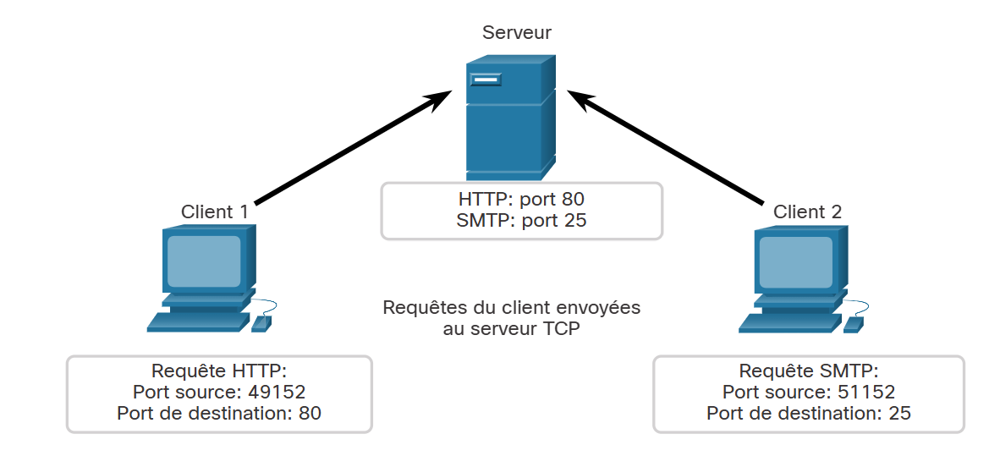

**Ports de destination des requêtes**

Les demandes génèrent dynamiquement un numéro de port source. Dans ce cas, le client 1 utilise le port source 49152 et le client 2 utilise le port source 51152.

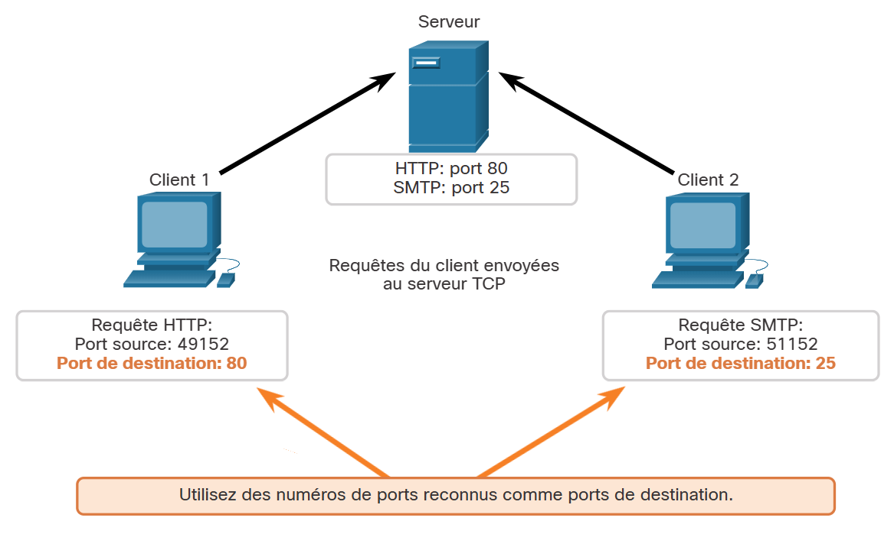

**Ports source des requêtes**

Lorsque le serveur répond aux demandes du client, il inverse les ports de destination et source de la demande initiale.

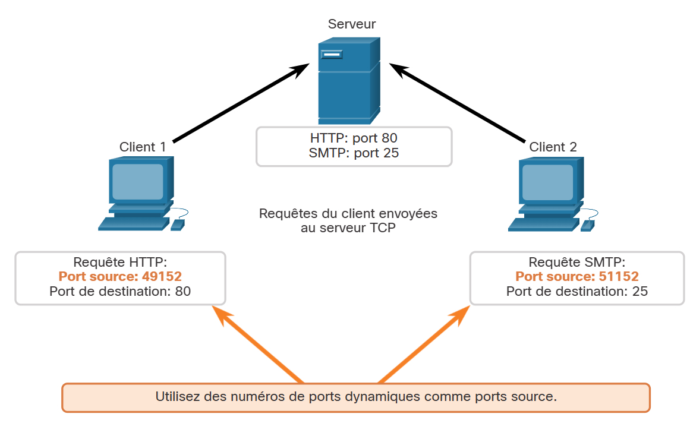

**Ports de destination des réponses**

Notez que la réponse du serveur à la demande Web a maintenant le port de destination 49152 et que la réponse e-mail a maintenant le port de destination 51152.

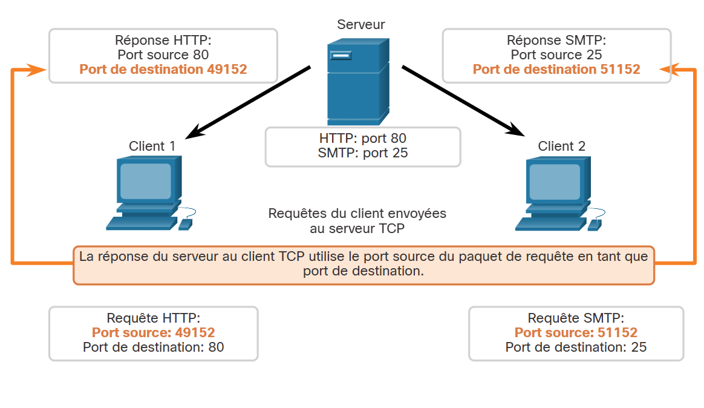

**Ports source des réponses**

Le port source dans la réponse du serveur est le port de destination d'origine dans les demandes initiales.

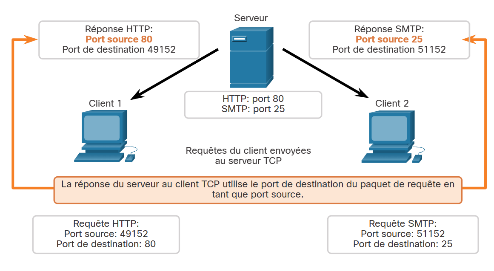

14.5.2 Établissement d'une connexion TCP

Dans certaines cultures, lorsque deux personnes se rencontrent, elles se saluent en se serrant la main. Les deux parties comprennent l'acte de serrer la main comme un signal de salutation amicale. D'une certaine manière, il en va de même pour les connexions sur le réseau. Dans les connexions TCP, le client hôte établit la connexion avec le serveur en utilisant le processus de poignée de main à trois voies.

**Étape 1. SYN**

Le client demande l'établissement d'une session de communication client-serveur avec le serveur.

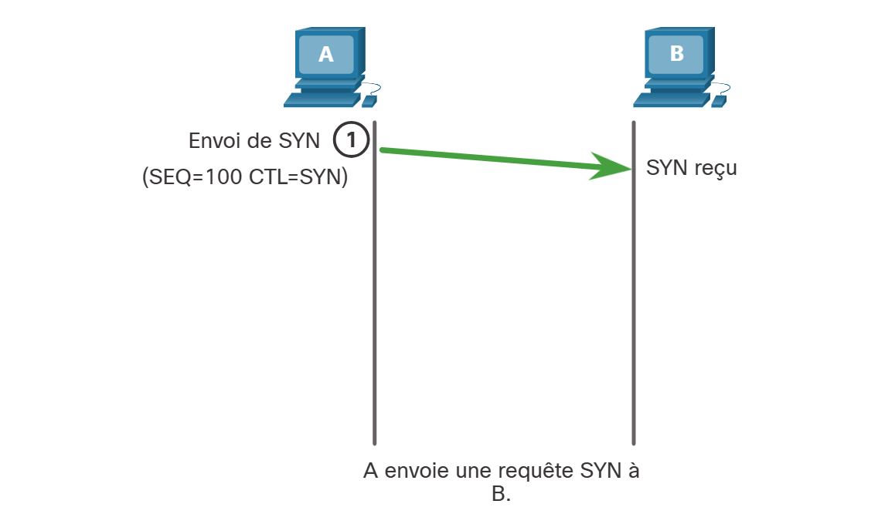

**Étape 2. ACK et SYN**

Le serveur accuse réception de la session de communication client-serveur et demande l'établissement d'une session de communication serveur-client.

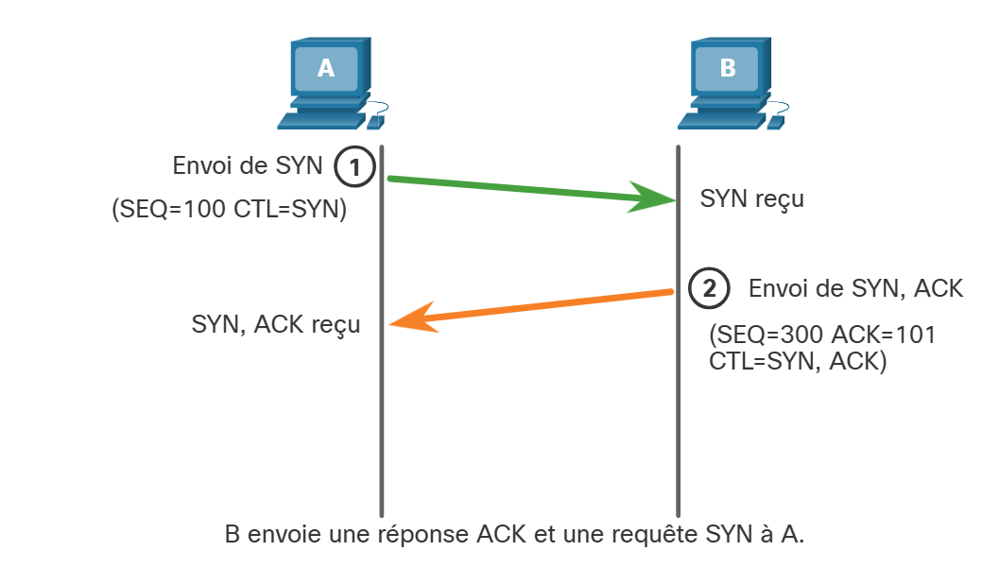

**Étape 3. ACK**

Le client accuse réception de la session de communication serveur-client.

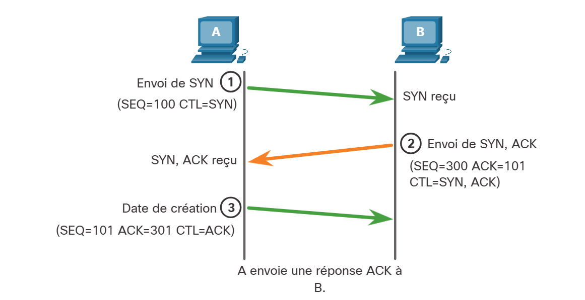

La connexion en trois étapes valide que l'hôte de destination est disponible pour communiquer. Dans cet exemple, l'hôte A a validé que l'hôte B est disponible.

14.5.3 Interruption de session

Pour mettre fin à une connexion, l'indicateur de contrôle FIN (Finish) doit être défini dans l'en-tête de segment. Pour mettre fin à chaque session TCP unidirectionnelle, on utilise un échange en deux étapes constitué d'un segment FIN et d'un segment ACK. Pour mettre fin à une seule conversation TCP, quatre échanges sont nécessaires pour mettre fin aux deux sessions. La terminaison peut être initiée par le client ou le serveur.

Dans l'exemple, les termes client et serveur sont utilisés comme référence pour plus de simplicité, mais deux hôtes quelconques qui ont une session ouverte peuvent lancer le processus de terminaison.

**Étape 1. FIN**

Quand le client n'a plus de données à envoyer dans le flux, il envoie un segment dont l'indicateur FIN est défini.

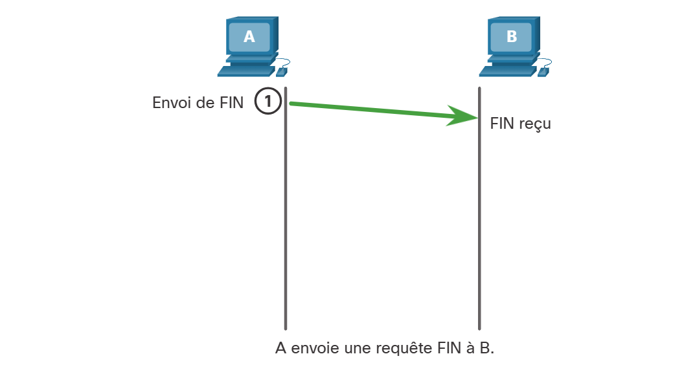

**Étape 2. ACK**

Le serveur envoie un segment ACK pour informer de la bonne réception du segment FIN afin de fermer la session du client au serveur.

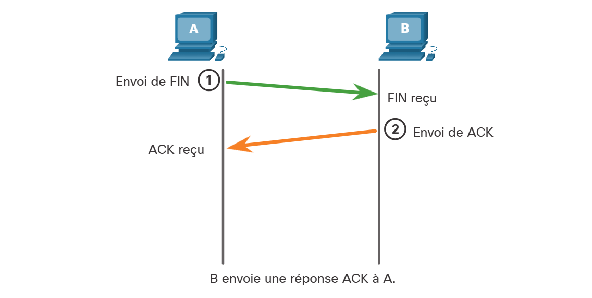

**Étape 3. FIN**

Le serveur envoie un segment FIN au client pour mettre fin à la session du serveur au client.

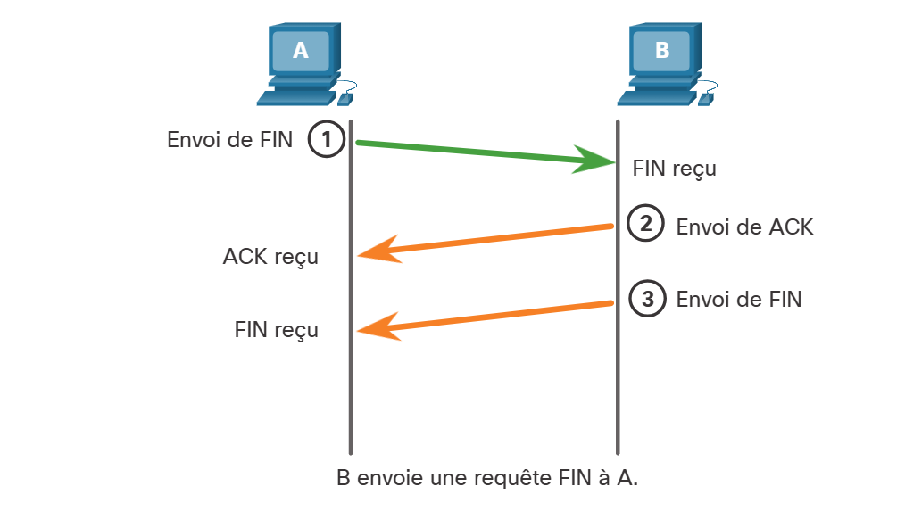

**Étape 4. ACK**

Le client répond à l'aide d'un segment ACK pour accuser réception du segment FIN envoyé par le serveur.

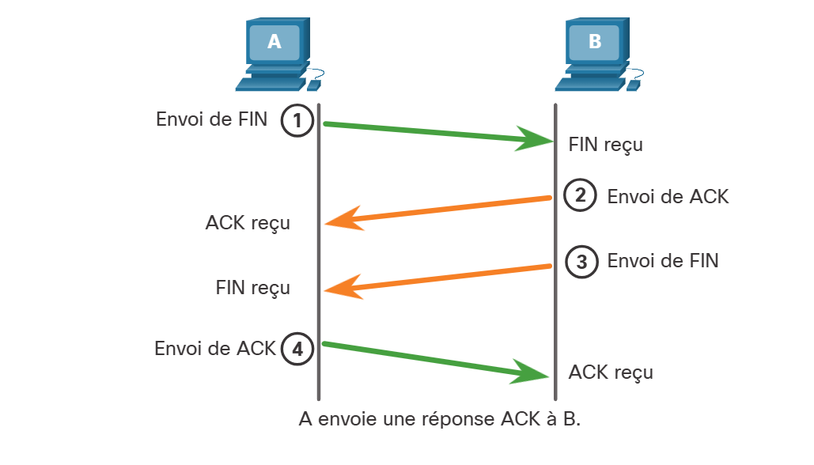

Quand la réception de tous les segments a été confirmée, la session est fermée.

14.5.4 Analyse de la connexion TCP en trois étapes

Les hôtes maintiennent l'état, suivent chaque segment de données au cours d'une session et échangent des informations sur les données reçues en utilisant les informations de l'en-tête TCP. TCP est un protocole full-duplex, où chaque connexion représente deux sessions de communication à sens unique. Pour établir la connexion, l'hôte effectue une connexion en trois étapes. Comme le montre la figure, les bits de contrôle dans l'en-tête TCP indiquent la progression et l'état de la connexion.

Ce sont les fonctions de la poignée de main à trois voies:

* Elle vérifie que le périphérique de destination est bien présent sur le réseau.
* Elle s'assure que le périphérique de destination a un service actif et qu'il accepte les requêtes sur le numéro de port de destination que le client qui démarre la session a l'intention d'utiliser.
* Elle informe le périphérique de destination que le client source souhaite établir une session de communication sur ce numéro de port.

Une fois la communication est terminée, les sessions sont terminées et la connexion est interrompue. Les mécanismes de connexion et de session permettent la fonction de fiabilité du TCP.

### Champ des bits de contrôle

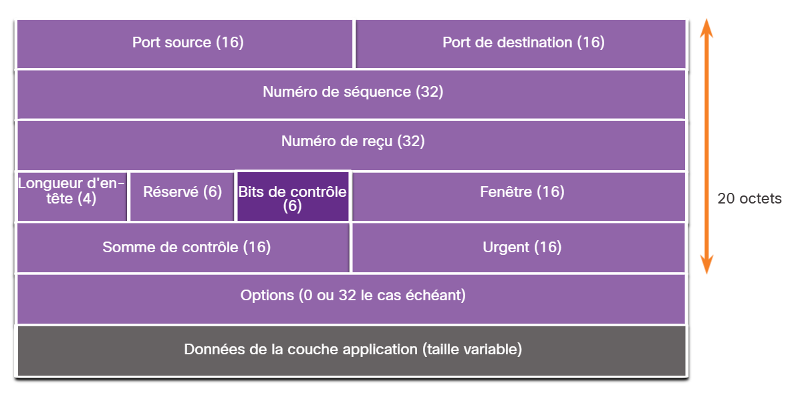

Les six bits du champ des bits de contrôle de l'en-tête du segment TCP sont également des indicateurs. Un indicateur est un bit qui est actif ou inactif.

Les six indicateurs de bits de contrôle sont les suivants:

* **URG** - Champ de pointeur urgent significatif (Urgent pointer field significant)
* **ACK** - Indicateur d'accusé de réception utilisé dans l'établissement de la connexion et la fin de la session
* **PSH** - Fonction push (Push function)
* **RST** - Réinitialisation de la connexion en cas d'erreur ou de dépassement de délai
* **SYN** - Synchroniser les numéros de séquence utilisés dans l'établissement de connexion
* **FIN** - Plus de données de l'expéditeur et utilisées dans la fin de session

Faites une recherche sur Internet pour en savoir plus sur les indicateurs de PSH et URG.

14.5.5 Vidéo - Poignée de main à 3 voies TCP

Cliquez sur le bouton Lecture dans la figure pour voir une démonstration vidéo, à l'aide de Wireshark, de la connexion TCP à trois voies.

<iframe src="https://www.netacad.com/content/itn/1.0/brightcovePlayer.html?videoId=6253937563001&playerId=4kbhhVWB6g&accountId=2649925992001&componentId=c76b71d1-3574-11ee-8257-9bcd80fefc7d&aspectRatio=16:9"></iframe>
