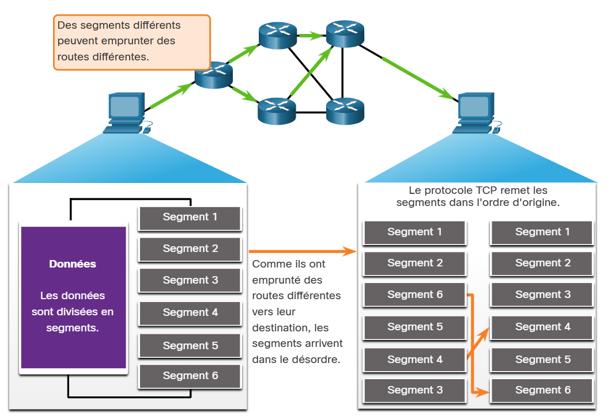

# 14.6 Fiabilité et contrôle des flux

14.6.1 Fiabilité du TCP - Livraison garantie et commandée

La raison pour laquelle TCP est le meilleur protocole pour certaines applications est que, contrairement à UDP, il renvoie les paquets abandonnés et numérote les paquets pour indiquer leur ordre correct avant la livraison. TCP peut également aider à maintenir le flux des paquets afin que les périphériques ne soient pas surchargés. Cette rubrique couvre en détail ces fonctionnalités de TCP.

Il peut arriver que les segments TCP n'arrivent pas à leur destination. D'autres fois, les segments TCP peuvent arriver en mauvais état. Pour que le message original soit compris par le destinataire, toutes les données doivent être reçues et les données de ces segments doivent être réassemblées dans l'ordre original. Pour cela, des numéros d'ordre sont affectés à l'en-tête de chaque paquet. Le numéro d'ordre représente le premier octet de données du segment TCP.

Lors de la configuration de la session, un numéro d'ordre initial, ou ISN, est défini. Cet ISN représente la valeur de départ des octets de cette session qui est transmise à l'application destinataire. Lors de la transmission des données pendant la session, le numéro d'ordre est incrémenté du nombre d'octets ayant été transmis. Ce suivi des octets de données permet d'identifier chaque segment et d'en accuser réception individuellement. Il est ainsi possible d'identifier les segments manquants.

L'ISN ne commence pas à un mais est en fait un nombre aléatoire. Cela permet d'empêcher certains types d'attaques de programmes malveillants. Pour des raisons de simplicité, nous utiliserons un ISN égal à 1 dans les exemples de ce chapitre.

Les numéros d'ordre des segments indiquent comment réassembler et réordonnancer les segments reçus, ainsi que l'illustre la figure ci-contre.

### Les segments TCP sont réorganisés au niveau de la destination

