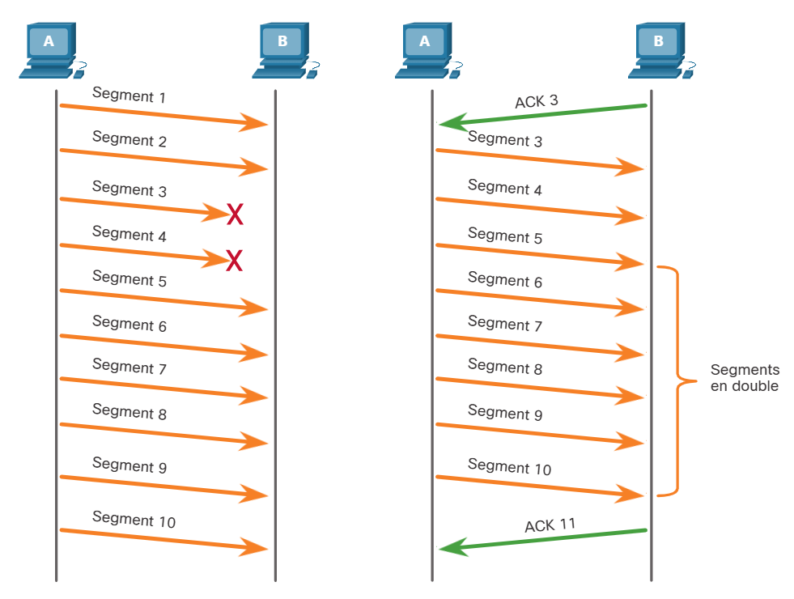
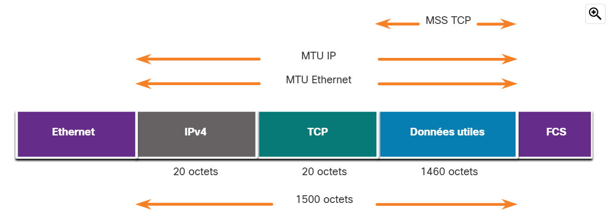

# 14.6 Fiabilité et contrôle des flux

14.6.1 Fiabilité du TCP - Livraison garantie et commandée

La raison pour laquelle TCP est le meilleur protocole pour certaines applications est que, contrairement à UDP, il renvoie les paquets abandonnés et numérote les paquets pour indiquer leur ordre correct avant la livraison. TCP peut également aider à maintenir le flux des paquets afin que les périphériques ne soient pas surchargés. Cette rubrique couvre en détail ces fonctionnalités de TCP.

Il peut arriver que les segments TCP n'arrivent pas à leur destination. D'autres fois, les segments TCP peuvent arriver en mauvais état. Pour que le message original soit compris par le destinataire, toutes les données doivent être reçues et les données de ces segments doivent être réassemblées dans l'ordre original. Pour cela, des numéros d'ordre sont affectés à l'en-tête de chaque paquet. Le numéro d'ordre représente le premier octet de données du segment TCP.

Lors de la configuration de la session, un numéro d'ordre initial, ou ISN, est défini. Cet ISN représente la valeur de départ des octets de cette session qui est transmise à l'application destinataire. Lors de la transmission des données pendant la session, le numéro d'ordre est incrémenté du nombre d'octets ayant été transmis. Ce suivi des octets de données permet d'identifier chaque segment et d'en accuser réception individuellement. Il est ainsi possible d'identifier les segments manquants.

L'ISN ne commence pas à un mais est en fait un nombre aléatoire. Cela permet d'empêcher certains types d'attaques de programmes malveillants. Pour des raisons de simplicité, nous utiliserons un ISN égal à 1 dans les exemples de ce chapitre.

Les numéros d'ordre des segments indiquent comment réassembler et réordonnancer les segments reçus, ainsi que l'illustre la figure ci-contre.

### Les segments TCP sont réorganisés au niveau de la destination

Le processus TCP récepteur place les données d'un segment dans une mémoire tampon de réception. Les segments sont ensuite placés dans l'ordre approprié et transmis à la couche d'application lorsqu'ils sont réassemblés. Tous les segments qui arrivent en désordre sont conservés en vue d'un traitement ultérieur. Ces segments sont ensuite traités dans l'ordre lorsque les segments contenant les octets manquants sont reçus.

14.6.2 Vidéo - Fiabilité du protocole TCP - Numéros d'ordre et accusés de réception

L'une des fonctions du TCP est de veiller à ce que chaque segment atteigne sa destination. Les services TCP sur l'hôte de destination accusent réception des données qui ont été reçues par l'application source.

Cliquez sur Lecture dans la figure pour afficher une présentation sur les numéros d'ordre et les accusés de réception.

<iframe src="https://www.netacad.com/content/itn/1.0/brightcovePlayer.html?videoId=6253938284001&playerId=4kbhhVWB6g&accountId=2649925992001&componentId=c77d9a45-3574-11ee-8257-9bcd80fefc7d&aspectRatio=16:9"></iframe>

14.6.3 Fiabilité du TCP - Perte de données et retransmission

Quelle que soit la conception d'un réseau, la perte de données qui se produit occasionnellement. Le protocole TCP fournit des méthodes de gestion des pertes de segments. Parmi elles se trouve un mécanisme de retransmission des segments pour les données sans accusé de réception.

Le numéro d'ordre (SEQ) et le numéro d'accusé de réception (ACK) sont utilisés ensemble pour confirmer la réception des octets de données contenus dans les segments envoyés. Le numéro SEQ identifie le premier octet de données dans le segment transmis. Le protocole TCP utilise le numéro ACK renvoyé à la source pour indiquer l'octet suivant que le destinataire s'attend à recevoir. C'est ce que l'on appelle un accusé de réception prévisionnel.

Avant les améliorations ultérieures, TCP ne pouvait reconnaître que l'octet suivant attendu. Par exemple, dans la figure, en utilisant des numéros de segment pour simplifier, l'hôte A envoie les segments 1 à 10 à l'hôte B. Si tous les segments arrivent à l'exception des segments 3 et 4, l'hôte B répondra en indiquant que le segment suivant attendu est le segment 3. L'hôte A n'a aucune idée si d'autres segments sont arrivés ou non. L'hôte A renverrait donc les segments 3 à 10. Si tous les segments de répétition arrivaient avec succès, les segments 5 à 10 seraient des doublons. Cela peut entraîner des retards, des embouteillages et des inefficacités.

Aujourd'hui, les systèmes d'exploitation hôtes utilisent généralement une fonctionnalité TCP facultative appelée reconnaissance sélective (SACK), négociée au cours de la poignée de main à trois voies. Si les deux hôtes prennent en charge SACK, le récepteur peut explicitement reconnaître quels segments (octets) ont été reçus, y compris les segments discontinus. L'hôte émetteur n'aurait donc qu'à retransmettre les données manquantes. Par exemple, dans la figure suivante, à nouveau en utilisant des numéros de segment pour simplifier, l'hôte A envoie les segments 1 à 10 à l'hôte B. Si tous les segments arrivent à l'exception des segments 3 et 4, l'hôte B peut reconnaître qu'il a reçu les segments 1 et 2 (ACK 3) et reconnaître sélectivement les segments 5 à 10 (SACK 5-10). L'hôte A n'aurait besoin que de renvoyer les segments 3 et 4.

**Remarque**: TCP envoie généralement des ACK pour tous les autres paquets, mais d'autres facteurs au-delà de la portée de cette rubrique peuvent modifier ce comportement.

TCP utilise des minuteries pour savoir combien de temps attendre avant de renvoyer un segment. Dans la figure, lisez la vidéo et cliquez sur le lien pour télécharger le fichier PDF. La vidéo et le fichier PDF examinent la perte de données TCP et la retransmission.

14.6.4 Vidéo - Fiabilité du TCP - Perte de données et retransmission

Cliquez sur Lecture dans la figure pour afficher une présentation sur la retransmission TCP.

<iframe src="https://www.netacad.com/content/itn/1.0/brightcovePlayer.html?videoId=6253937925001&playerId=4kbhhVWB6g&accountId=2649925992001&componentId=c78a4473-3574-11ee-8257-9bcd80fefc7d&aspectRatio=16:9"></iframe>

14.6.5 Contrôle de flux TCP - Taille de fenêtre et accusés de réception

Le protocole TCP offre des mécanismes de contrôle des flux. Le protocole TCP inclut également des mécanismes de contrôle de flux, qui correspond au volume de données que l'hôte de destination peut recevoir et traiter de manière fiable. Le contrôle de flux aide à maintenir la fiabilité des transmissions TCP en réglant le flux de données entre la source et la destination pour une session donnée. Pour cela, l'en-tête TCP inclut un champ de 16 bits appelé taille de fenêtre.

La figure illustre un exemple de taille de fenêtre et d'accusés de réception.

### Exemple de taille de fenêtre TCP

La taille de fenêtre détermine le nombre d'octets qui peuvent être envoyés avant de recevoir un accusé de réception. Le numéro d'accusé de réception est le numéro du prochain octet attendu.

La taille de fenêtre est le nombre d'octets que le périphérique de destination d'une session TCP peut accepter et traiter en une fois. Dans cet exemple, la taille initiale de la fenêtre du PC B pour la session TCP est de 10000 octets. En commençant par le premier octet, à savoir l'octet numéro 1, le dernier octet que le PC-A peut envoyer sans recevoir d'accusé de réception est l'octet 10000. C'est ce qu'on appelle la fenêtre d'envoi du PC A. La taille de la fenêtre est incluse dans chaque segment TCP, de sorte que la destination peut modifier la taille de la fenêtre à tout moment en fonction de la disponibilité de la mémoire tampon.

La taille de fenêtre initiale est déterminée lors de l'établissement de la session TCP par l'intermédiaire de la connexion en trois étapes. Le périphérique source doit limiter le nombre d'octets envoyés au périphérique de destination en fonction de la taille de la fenêtre de la destination. Une fois que le périphérique source a reçu un accusé de réception l'informant que les octets ont été reçus, il peut continuer à envoyer plus de données pour la session. D'une manière générale, la destination n'attend pas que tous les octets de sa taille de fenêtre aient été reçus avant de répondre par un accusé de réception. Une fois que tous les octets ont été reçus et traités, la destination envoie des accusés de réception afin d'informer la source qu'elle peut continuer à envoyer des octets supplémentaires.

Par exemple, il est typique que le PC B n'attende pas que les 10000 octets aient été reçus avant d'envoyer un accusé de réception. Cela signifie que le PC A peut ajuster sa fenêtre d'envoi lorsqu'il reçoit des accusés de réception du PC B. Comme le montre la figure, lorsque le PC A reçoit un accusé de réception portant le numéro 2921, qui est le prochain octet attendu. La fenêtre d'envoi PC A va incrémenter 2920 octets. Cela change la fenêtre d'envoi de 10000 octets à 12920. Le PC A peut maintenant continuer à envoyer jusqu'à 10000 octets supplémentaires au PC B tant qu'il n'envoie pas plus que sa nouvelle fenêtre d'envoi à 12920.

Une destination qui envoie des accusés de réception au fur et à mesure qu'elle traite les octets reçus, et l'ajustement continu de la fenêtre d'envoi source, sont connus sous le nom de fenêtres coulissantes. Dans l'exemple précédent, la fenêtre d'envoi du PC A incrémente ou glisse sur un autre 2 921 octets, passant de 10000 à 12920.

Si l'espace libre dans la mémoire tampon de la destination diminue, cette dernière peut réduire sa taille de fenêtre afin de demander à la source de diminuer le nombre d'octets envoyés avant de recevoir un accusé de réception.

**Remarque**: Les appareils d'aujourd'hui utilisent le protocole des fenêtres coulissantes. Le récepteur envoie généralement un accusé de réception tous les deux segments qu'il reçoit. Le nombre de segments reçus avant l'envoi d'un accusé de réception peut varier. L'avantage des fenêtres dynamiques est de permettre à l'expéditeur de transmettre des segments en continu, tant que le destinataire accuse réception des segments précédents. Les détails de la fonction de hachage sortent du cadre de ce cours.

14.6.6 Contrôle de flux TCP - Taille maximale du segment (MSS)

Dans la figure, la source transmet 1460 octets de données dans chaque segment TCP. Il s'agit généralement de la taille maximale de segment (MSS) que le périphérique de destination peut recevoir. Le MSS fait partie du champ d'options de l'en-tête TCP qui spécifie la plus grande quantité de données, en octets, qu'un périphérique peut recevoir dans un seul segment TCP. La taille MSS n'inclut pas l'en-tête TCP. Le MSS est généralement inclus lors de la poignée de main à trois voies.

Un MSS commun est de 1 460 octets lors de l'utilisation d'IPv4. Un hôte détermine la valeur de son champ MSS en soustrayant les en-têtes IP et TCP de la MTU Ethernet. La MTU par défaut d'une interface Ethernet est de 1500 octets. En retranchant l'en-tête IPv4 de 20 octets et l'en-tête TCP de 20 octets, la taille par défaut du MSS sera de 1460 octets, comme le montre la figure.

14.6.7 Contrôle de flux TCP - Prévention des encombrements

Lorsque la congestion se produit sur un réseau, elle a pour conséquence que les paquets sont rejetés par le routeur surchargé. Lorsque les paquets contenant des segments TCP n'atteignent pas leur destination, ils sont laissés sans accusé de réception. En déterminant la vitesse à laquelle les segments TCP sont envoyés, mais non reçus, la source peut estimer le niveau d'encombrement du réseau.

Chaque fois qu'il y a encombrement, les segments TCP perdus sont retransmis par la source. Si la retransmission n'est pas correctement contrôlée, une retransmission supplémentaire des segments TCP peut aggraver encore le niveau d'encombrement du réseau. Non seulement de nouveaux paquets contenant des segments TCP sont introduits sur le réseau, mais l'effet de rétroaction des segments TCP perdus et retransmis encombre encore davantage le réseau. Afin d'éviter et de contrôler l'encombrement du réseau, le protocole TCP utilise divers mécanismes, minuteurs et algorithmes de gestion des encombrements.

Si la source détermine que les segments TCP n'ont pas été reçus ou qu'ils n'ont pas été reçus à temps, elle peut diminuer le nombre d'octets à envoyer avant la réception d'un accusé de réception. Comme illustré dans la figure, PC A détecte une congestion et réduit donc le nombre d'octets qu'il envoie avant de recevoir un accusé de réception de PC B.

### Contrôle d'encombrement TCP

Les numéros d'accusé de réception se réfèrent à l'octet suivant attendu et non à un segment. Les numéros de segment utilisés sont simplifiés pour les besoins de l'illustration.

Notez que c'est la source qui diminue le nombre d'octets non reçus à envoyer et non la taille de fenêtre déterminée par la destination.

**Remarque:** L'explication des mécanismes, des minuteurs et des algorithmes réels de gestion des encombrements sort du cadre de ce cours.
