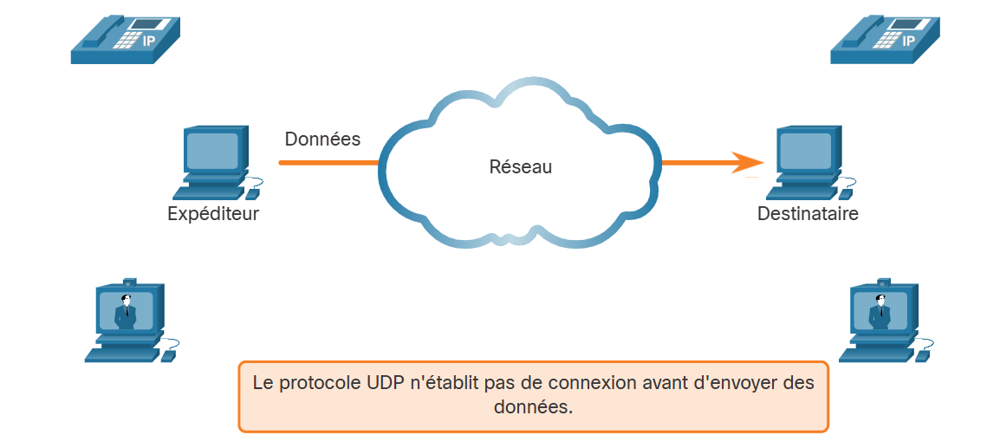
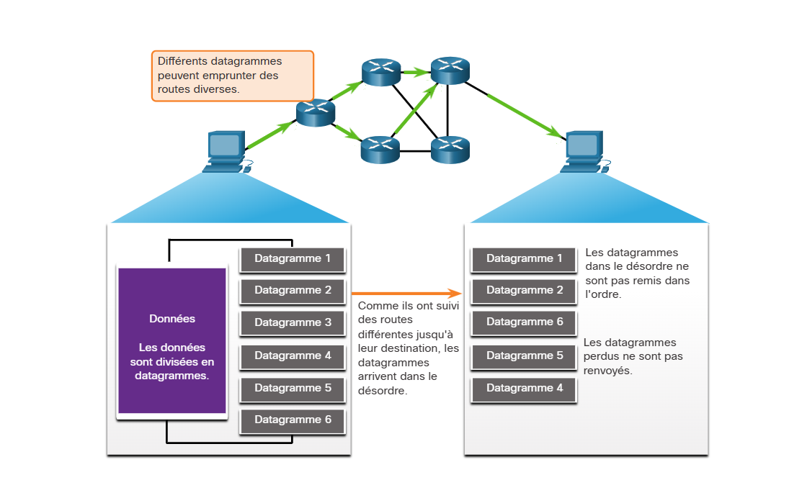
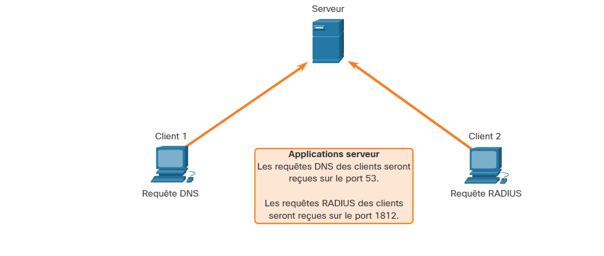
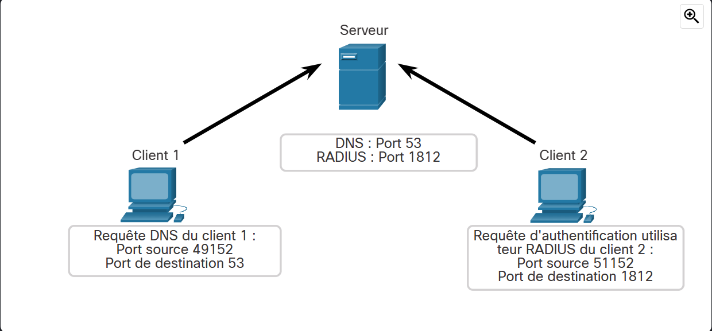
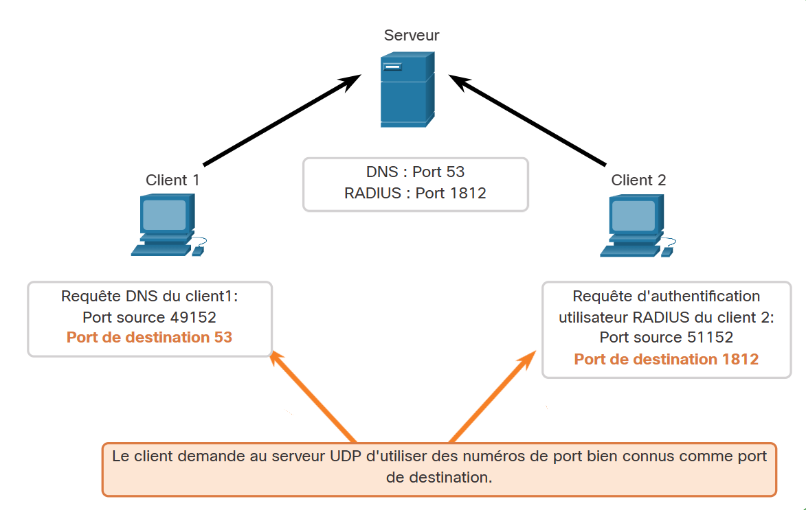
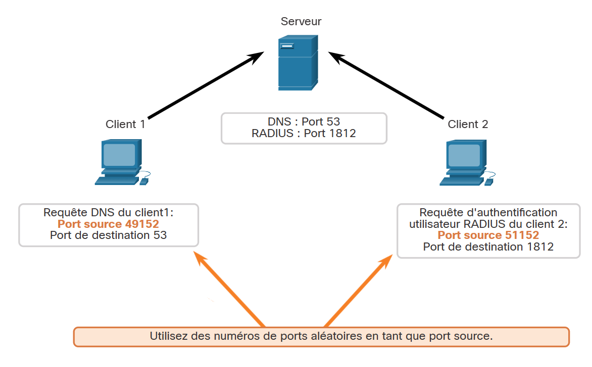
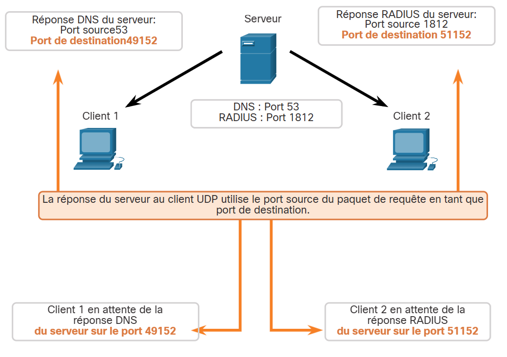
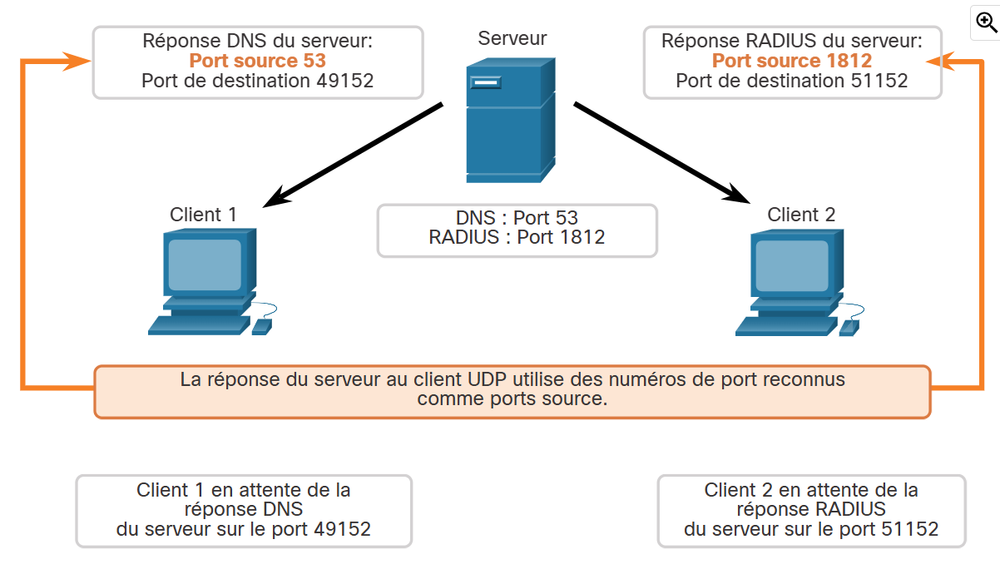

# 14.7 Communication UDP

14.7.1 Faible surcharge et fiabilité du protocole UDP

Comme expliqué précédemment, UDP est parfait pour les communications qui doivent être rapides, comme la VoIP. Cette rubrique explique en détail pourquoi UDP est parfait pour certains types de transmissions. Comme le montre la figure, UDP n'établit pas de connexion. Le protocole UDP fournit un transport de données à faible surcharge car il utilise de petits en-têtes de datagrammes et n'offre pas de gestion du trafic réseau.

14.7.2 Réassemblage de datagrammes UDP

Comme pour les segments envoyés au moyen du protocole TCP, lorsque des datagrammes UDP sont envoyés vers une destination, ils peuvent souvent emprunter des chemins différents et arriver dans le désordre. Le protocole UDP n'effectue pas de suivi des numéros d'ordre comme le fait le protocole TCP. Le protocole UDP ne peut pas réassembler les datagrammes dans leur ordre de transmission, comme illustré dans la figure.

Le protocole UDP se contente donc de réassembler les données dans l'ordre dans lequel elles ont été reçues, puis de les transmettre à l'application. Si l'ordre des données est important pour l'application, cette dernière doit identifier l'ordre correct et déterminer le mode de traitement des données.

### UDP : sans connexion et peu fiable

14.7.3 Processus et requêtes des serveurs UDP

Comme pour les applications basées sur le protocole TCP, des numéros de ports réservés sont affectés aux applications serveur basées sur le protocole UDP, comme le montre la figure. Lorsque ces applications ou processus s'exécutent sur un serveur, elles ou ils acceptent les données correspondant au numéro de port attribué. Quand le protocole UDP reçoit un datagramme destiné à l'un de ces ports, il transmet les données applicatives à l'application appropriée d'après son numéro de port.

### Écoute du serveur UDP pour les requêtes

**Remarque:** Le serveur RADIUS (Remote Authentication Dial-in User Service) illustré dans la figure fournit des services d'authentification, d'autorisation et de comptabilité pour gérer l'accès des utilisateurs. Le fonctionnement de RADIUS sort du cadre de ce cours.

14.7.4 Processus des clients UDP

Comme c'est le cas avec le protocole TCP, la communication entre le client et le serveur est initiée par une application cliente qui demande des données à un processus serveur. Le processus client UDP sélectionne dynamiquement un numéro de port dans une plage de numéros de ports et il l'utilise en tant que port source pour la conversation. Le port de destination est généralement le numéro de port réservé affecté au processus serveur.

Après qu'un client a sélectionné les ports source et destination, la même paire de ports est utilisée dans l'en-tête de tous les datagrammes de la transaction. Quand des données sont renvoyées du serveur vers le client, les numéros de port source et de port de destination sont inversés dans l'en-tête du datagramme.

**Clients envoyant des requêtes UDP**

Le client 1 envoie une requête DNS en utilisant le port 53 bien connu tandis que le client 2 demande les services d'authentification RADIUS en utilisant le port 1812 enregistré.

**Ports destination des requêtes UDP**

Les requêtes des clients génèrent dynamiquement des numéros de port source. Dans ce cas, le client 1 utilise le port source 49152 et le client 2 utilise le port source 51152.

Les requêtes a au serveur DNS utilisent le port de destination UDP 53

**Ports source des requêtes UDP**

Lorsque le serveur répond aux demandes du client, il inverse les ports de destination et source de la demande initiale.

**Destination de la réponse UDP**

Dans la réponse du serveur à la demande DNS est maintenant le port de destination 49152 et la réponse d'authentification RADIUS est maintenant le port de destination 51152.

Lorsque le serveur DNS élabore des réponses aux demandes du client. Les numéros de port source et de destination sont commutés de sorte que les ports de destination sont le numéro de port aléatoire des clients

**Ports source des réponses**

Les ports source dans la réponse du serveur sont les ports de destination d'origine dans les demandes initiales.

**Remarque:** Le serveur RADIUS (Remote Authentication Dial-in User Service) illustré dans la figure fournit des services d'authentification, d'autorisation et de comptabilité pour gérer l'accès des utilisateurs. Le fonctionnement de RADIUS sort du cadre de ce cours.
